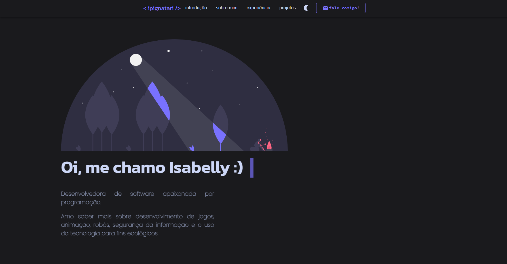

# Personal website portfolio
In this project you can find a few informations about me as a software and game developer. Also, you can see an overview of my personal projects.

This project was bootstrapped with [Create React App](https://github.com/facebook/create-react-app).\
In the project directory, you can run:
  
### - `npm start`
Runs the app in the development mode.\
Open [http://localhost:3000](http://localhost:3000) to view it in your browser.

### - `npm run build`

Builds the app for production to the `build` folder.\
It correctly bundles React in production mode and optimizes the build for the best performance.

Currently website page:

